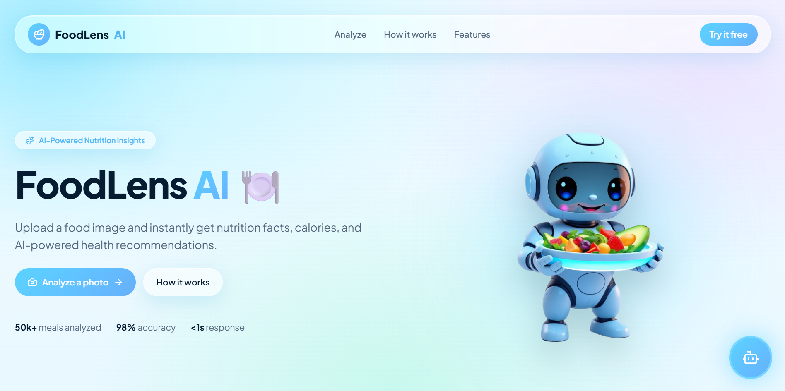
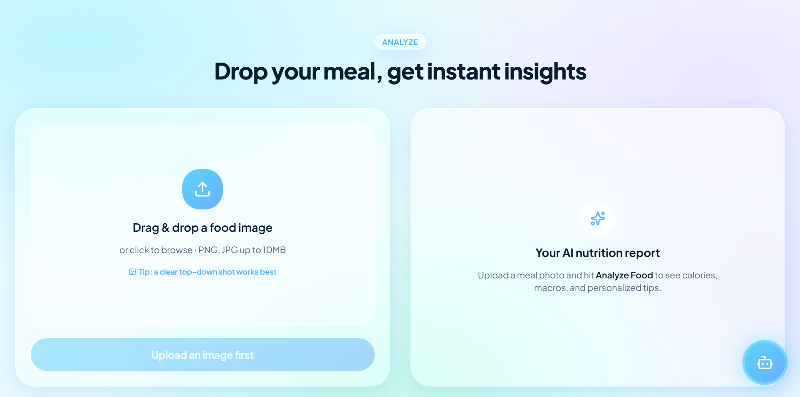
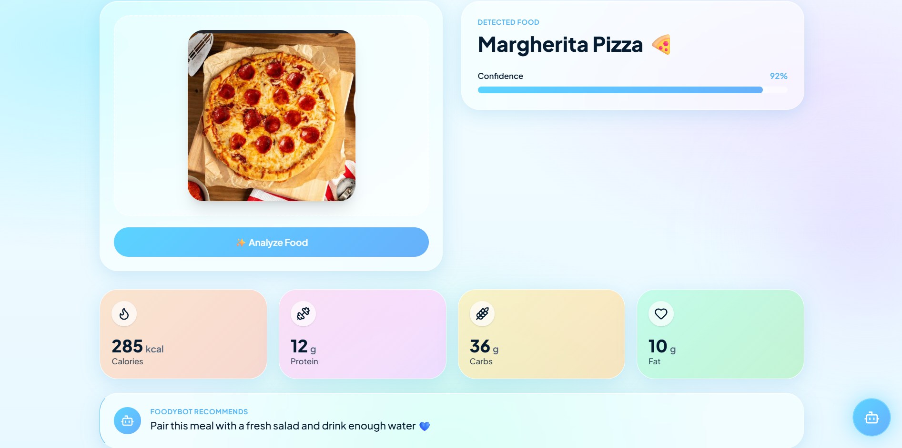
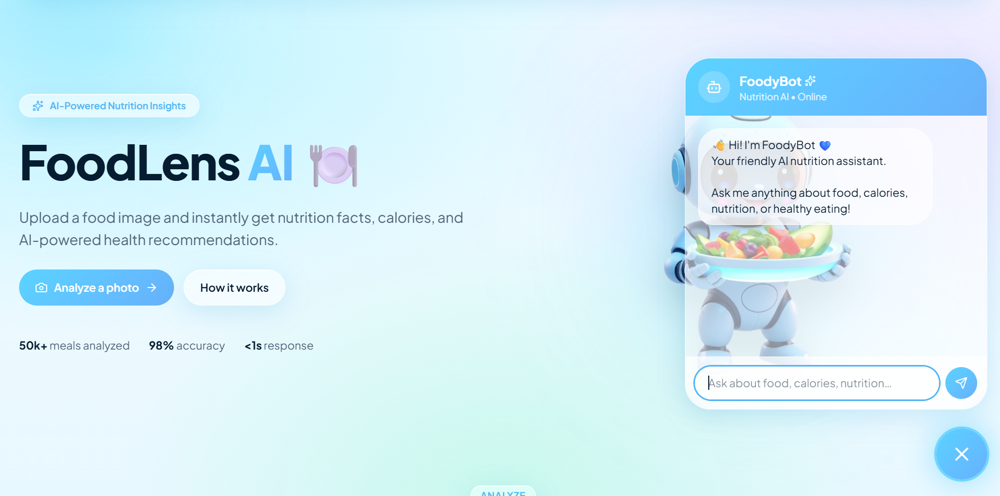

# 🍽️ FoodLens AI

> AI-powered Food Recognition & Nutrition Recommendation System using Computer Vision, RAG, Gemini AI, and Streamlit.

## 🌟 Overview

FoodLens AI is an intelligent food recognition system that identifies food items from images, provides nutritional information, and answers food-related questions using an AI-powered chatbot.

The project combines Computer Vision, Retrieval-Augmented Generation (RAG), and Google's Gemini AI to create an interactive nutrition assistant.

---

## 🚀 Live Demo

🌐 **Frontend (Lovable):**
https://foodlens-ai-ns.lovable.app/

💻 **GitHub Repository:**
https://github.com/nimmala-nityasree/FoodLens-AI

---

## ✨ Features

- 📸 Food Image Recognition
- 🍕 Detects Food using AI
- 🥗 Nutrition Information
- 💡 Healthy Recommendations
- 🤖 AI Nutrition Chatbot (FoodyBot)
- 📚 RAG-based Knowledge Retrieval
- ⚡ Fast FAISS Search
- 🎨 Beautiful Modern UI

---

## 🛠️ Tech Stack

### Frontend
- Lovable
- Streamlit

### Backend
- Python

### AI & Machine Learning
- TensorFlow
- Hugging Face Transformers
- Computer Vision

### LLM
- Google Gemini API

### RAG
- LangChain
- FAISS

### Dataset
- Food-101
- Custom Nutrition Dataset

---

## 📂 Project Structure

```
FoodLens-AI/
│
├── assets/
├── cnn/
├── data/
├── faiss_index/
├── rag/
├── screenshots/
├── utils/
│
├── app.py
├── README.md
├── requirements.txt
└── .gitignore
```

---

## 📸 Screenshots

### 🏠 Home Page



---

### 🍕 Food Detection



---

### 🥗 Nutrition Information



---

### 🤖 FoodyBot



---

## ⚙️ Installation

Clone the repository

```bash
git clone https://github.com/nimmala-nityasree/FoodLens-AI.git
```

Move into the project

```bash
cd FoodLens-AI
```

Install dependencies

```bash
pip install -r requirements.txt
```

Create a `.env` file

```
GEMINI_API_KEY=YOUR_API_KEY
```

Run the application

```bash
py -3.11 -m streamlit run app.py
```

---

## 🎯 Future Improvements

- Barcode Scanner
- Calorie Tracking
- Meal Planner
- Personalized Diet Suggestions
- Mobile Application
- Multi-language Support

---

## 👩‍💻 Author

**Nimmala Nityasree**

GitHub:
https://github.com/nimmala-nityasree

---

⭐ If you like this project, consider giving it a star!
